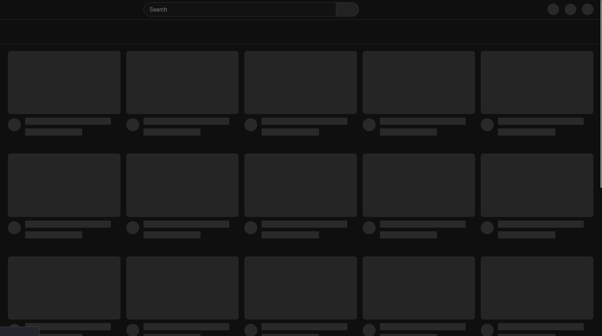
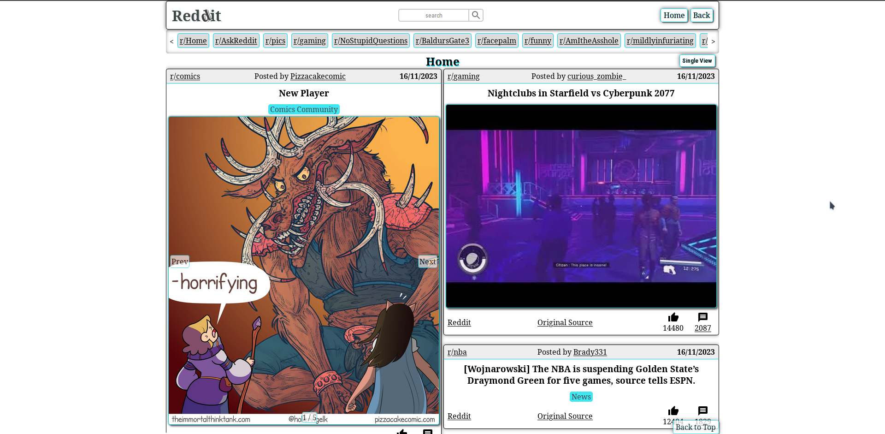
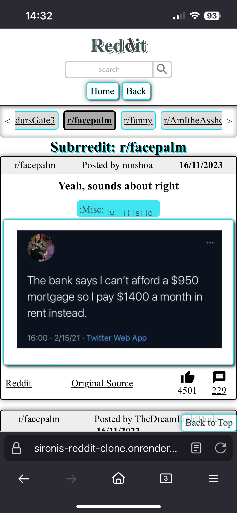

# Reddit Front-end Clone
This project is a **read only** reddit client clone, Using data fetched from the **reddit API**. My goal was to display posts like on YouTube, but the project changed as I continued.

## Technologies
* React + Vite
* React-router

API Fetch where done by appending ```.json``` to the end of the url, but before the Query String. Original URL: (https://www.reddit.com/)
JSON URL: (https://www.reddit.com/.json)


## Features
single / split view toggle between post rendering full width or dividing the screen and posts.
clicking the post title takes the user to the post's page

## Usage
Clone or Download the project then run the following commands in your terminal on "Linux & Mac". 
```bash
cd my-reddit-clone
npm i
npm run dev
```

### Deployment
Use ```npm run build``` to create static files which can found in `./dist` and ```npm run preview``` run a local network server

### Testing
Use ```npm run test``` run tests. 

## Future
  * On the Home page an eventListener could be implemented that when the end of posts is reached, Trigger a fetch resulting in infinity scrolling.

* In the comment section, load more comments should be implemented

* Theme Switching

* Post img / Carousel could use timeout to alternate between images if more than 1 images.

* Add video player

* ViewOptions could be added to filter and control viewed posts.
* Allowing the user to increase the fetched posts limit.

* Implement comments nesting using `depth` and `parent_id`

## Design



